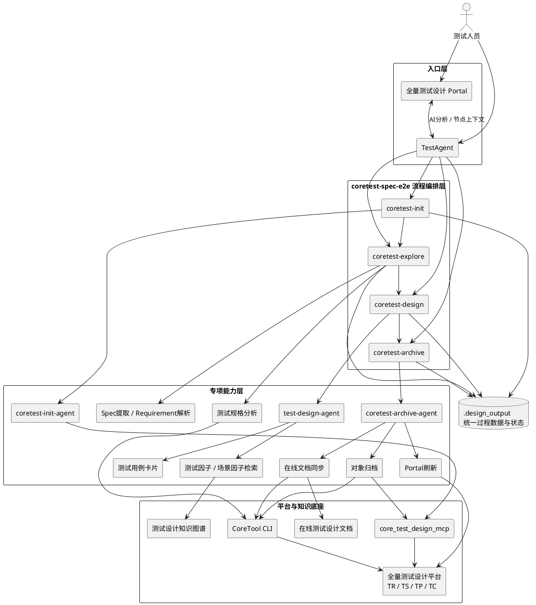
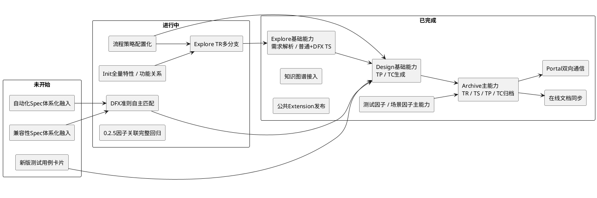

# E2E测试Agent进展及下一步规划

> 汇报时间：2026-09-21  
> 汇报范围：E2E测试Agent阶段进展、使用效果、下一步计划及测试领域知识诉求

## 1. 背景

测试领域已经具备需求分析、测试设计、脚本生成、代码检索、脚本调测等多类AI能力，但早期能力更多以单点Skill或独立流程存在，需求到测试资产、再到自动化实现之间仍需要较多人工串联。

E2E测试Agent的建设目标，是以**测试Spec和领域知识**为核心，将需求分析、测试规格、测试设计、测试资产归档逐步串成统一流程，并继续向自动化测试方案、AW/Codebase、脚本生成与调测延伸。同时通过公共Extension沉淀公共能力，降低不同产品重复建设和二次适配成本。

整体建设路径可以概括为：

```text
单点AI能力
    ↓
需求到测试设计E2E流程
    ↓
公共Extension与平台融合
    ↓
测试领域知识增强
    ↓
面向多产品规模复用
    ↓
设计到自动化执行闭环
```

当前阶段已经完成从“单点能力/流程穿刺”向“公共能力、真实业务使用和持续工程化”的转换，后续重点开始转向**DFX专业能力、领域知识和规模化复用**。

---

## 2. E2E测试Agent目标与效果衡量

### 2.1 目标

| 目标方向 | 目标值 | 当前值 | 当前差距 |
|---|---:|---:|---:|
| 先锋PDU E2E测试占比 | **30%** | **5.29%** | **24.71个百分点** |
| 脚本调测 + AW代码生成：AI生成脚本代码入库占比 | **100%** | **88.35%** | **11.65个百分点** |

其中，E2E测试占比按以下口径统计：

```text
AI辅助测试设计
∩
(
  (AI辅助测试代码生成入库 ∩ 自动化执行)
  ∪ AI辅助测试执行
)
÷ 新增用例
```

E2E测试Agent的建设重点，是围绕以上两个业务目标逐步打通“需求 → 测试设计 → 自动化实现 → 执行调测”的端到端链路，而不是只建设单点生成能力。

### 2.2 子专题

| 子专题 | 核心建设内容 | 当前定位 |
|---|---|---|
| coretest-spec-e2e | Init、Explore、Design、Archive；需求解析、普通/DFX测试规格、TP/TC生成、平台归档、在线文档、Portal卡片、流程策略配置化 | 打通“需求 → 测试规格 → 测试设计 → 平台资产”的主流程，并沉淀为公共Extension |
| 测试知识增强 | 测试设计知识图谱、测试因子/场景因子、DFX Spec/准则、历史测试资产、调测经验 | 将测试经验和专业知识持续融入Agent，从Prompt驱动逐步升级为知识驱动 |
| 自动化测试方案 | 基于需求/接口设计生成自动化交互方案Spec，结合测试组网、接口、数据准备等知识持续积累 | 建立测试设计到自动化实现之间的中间层，为脚本生成提供结构化方案输入 |
| AW代码生成 | AW Function Advisor、Codebase检索，判断AW复用、修改或新增 | 提升自动化能力复用率和AW代码生成准确性，减少重复开发 |
| 脚本生成与调测 | 测试脚本生成、相似步骤检索、自动执行、脚本调测、调测经验提取与回流 | 打通自动化实现、执行反馈和经验沉淀闭环，支撑AI生成脚本代码入库目标 |


### 2.3 效果衡量

截至 **2026-09-21**：

| 衡量维度 | 指标 | 当前结果 | 说明 |
|---|---|---:|---|
| 核心目标 | 先锋PDU E2E测试占比 | **5.29%** | 目标30%，当前仍有24.71个百分点提升空间 |
| 业务产出 | E2E累计产出测试用例 | **880个** | 分组实际业务产出 |
| 设计质量 | 穿刺需求用例接纳率 | **92.6%** | 独立穿刺需求效果评测，与880个用例统计口径不同 |
| AI化程度 | 同期测试用例AI生成占比 | **0.88% → 44.69%** | 整体AI生成指标，同期提升，不全部归因于E2E Test Agent |
| 公共复用 | `coretest-spec-e2e` 下载量 | **247** | 公共Extension已有实际使用基础 |
| 公共复用 | 基于公共包开发的产品 | **≥9个** | 已从UPCF单场景穿刺扩展到多产品复用 |
| 工程成熟度 | 发布版本记录 / 持续升级 | **7个版本记录 / 6轮升级** | 从v0.1.11持续演进到v0.2.4 |
| 用户反馈 | 已闭环用户问题 | **10个** | 已进入真实用户使用、反馈和持续修复阶段 |
| 知识沉淀 | 脚本调测经验沉淀到云见 | **125条** | 将真实脚本调测轨迹提炼为可复用经验知识 |
| 知识消费 | 相似步骤检索Skill调用量 | **1.3k** | 反映历史测试资产检索能力已进入实际使用 |
| 脚本目标 | AI生成脚本代码入库占比 | **88.35%** | 截至2026-09-21；目标100%，当前仍有11.65个百分点提升空间 |

> 数据来源：产品数字化与IT装备运营工作台、AgentCenter、穿刺需求效果评测及用户问题跟踪记录。

---

## 3. E2E测试Agent当前架构与流程设计

### 3.1 当前E2E架构

当前架构以 `coretest-spec-e2e` 公共Extension为流程主体，TestAgent和全量测试设计Portal作为入口；Init、Explore、Design、Archive负责主流程编排，专项Skill/Agent负责需求解析、测试设计、因子检索、对象归档、在线文档和卡片等具体能力；各阶段通过统一的 `.design_output` 目录传递确定性产物。



架构中的几个关键设计点：

- **统一入口**：既支持在TestAgent中手工执行命令，也支持Portal卡片从TR/TS节点直接触发Explore/Design；两种入口最终进入同一套流程。
- **主流程与专项能力解耦**：Init/Explore/Design/Archive负责阶段编排，复杂动作下沉到Agent、Skill和确定性脚本，降低主流程复杂度。
- **统一过程数据**：各阶段共享 `.design_output/<design_task_id>/TR_<tr_id>/`，通过文件契约传递上下文、设计产物、执行计划和状态，不依赖Agent记忆串联阶段。
- **AI分析与确定性操作分离**：测试规格、TP/TC设计和知识选择由Agent完成；平台对象创建、状态持久化、在线文档写入等确定性操作由脚本、CLI/MCP完成。
- **现有平台优先复用**：已有TR和平台DFX TS直接复用，不重复创建；Archive对成功对象幂等复用，保证重跑安全。

### 3.2 当前E2E流程设计

当前E2E流程由4个核心命令组成，各命令通过统一的 `.design_output/<design_task_id>/TR_<tr_id>/` 目录传递上下文和产物。

| 命令 | 主要功能 | 核心输入 | 主要产出/结果 |
|---|---|---|---|
| `/coretest-init "<产品版本>"` | 初始化测试设计上下文；查询设计任务、平台已有TR及TR直接关联需求，为后续Explore提供统一上下文 | 产品版本，例如 `UPCF 27.0.0` | `design_task_info.json`、`tr_info.json`、`cida_info.json` |
| `/coretest-explore <tr_id>` | 基于TR关联需求下载并解析IDP/DBOX文档，生成系统需求、功能设计、SR规格和普通/DFX测试规格；统一普通TS与平台DFX TS编号；可选提前归档本轮普通TS | TR ID | `系统需求.md`、`功能设计.md`、`sr_specs/`、`platform_ts.json`、`tr_ts.json`、`ts_catalog.json` |
| `/coretest-design <tr_id> [TS选择器...]` | 按全部或指定TS生成TP/TC；每批最多并行3个TS；完成测试因子/场景因子候选检索、本地因子计划和测试用例卡片更新 | TR ID，可选稳定TS编号或真实平台TS ID | TS级测试设计Markdown、TP/TC JSON、`factor_candidates.json`、`factor_plan.json`、completed测试用例卡片 |
| `/coretest-archive <tr_id> <目标...>` | 按TR/TS/TP/TC或指定对象锁定归档范围；创建或复用平台对象；执行TS/TP因子关联；同步在线文档并刷新Portal | TR ID + 归档目标 | 平台TR/TS/TP/TC对象、因子关系、`archive_state.json`、在线文档同步结果、Portal结果 |

四个命令之间的职责边界：

| 阶段 | 主要职责 | 不负责的内容 |
|---|---|---|
| Init | 获取并固化平台测试设计上下文 | 不生成测试规格或测试设计 |
| Explore | 完成“需求 → 测试规格”，建立统一TS目录 | 不生成TP/TC |
| Design | 完成“TS → TP/TC”，并生成本地因子计划 | 不直接写入平台因子关系 |
| Archive | 执行真实平台对象、因子和文档写入 | 不重新生成测试规格和TP/TC |


---

## 4. 当前进展

### 4.1 概览

下面按当前模块状态展示E2E测试Agent建设进展。**已完成**表示主能力已进入当前流程；**进行中**表示已有基础但仍在补齐本阶段目标；**未开始**表示已明确规划、尚未进入实现。




### 4.2 已完成

| 类别 | 已完成内容 | 结果/价值 |
|---|---|---|
| 主流程闭环 | 完成Init、Explore、Design、Archive主链路建设 | 从需求上下文进入测试规格、测试设计，再到平台归档形成完整流程 |
| Explore能力 | 支持需求文档解析、普通TS、平台DFX TS、统一稳定TS编号 `ts_catalog.json` | 普通TS与DFX TS进入同一后续设计流程，DFX平台对象直接复用 |
| Design能力 | 支持按TR或指定TS设计TP/TC，支持稳定TS编号和真实平台TS ID输入；每批最多3个TS并行 | 将设计粒度下沉到单TS，兼顾并发效率和TS边界控制 |
| Archive能力 | 支持TR/TS/TP/TC精确归档、对象复用、执行计划、状态持久化、幂等和断点续跑 | 从“能创建对象”提升到“范围可控、失败可恢复、重跑安全” |
| 在线文档 | 完成任务/TR/TS过程文档写入对应章节，对象状态与文档状态隔离 | 测试设计过程可直接进入在线评审链路 |
| Portal交互 | 完成Portal与TestAgent双向通信；TR节点可触发Explore，TS节点可触发Design | Agent能力融入现有测试生产入口，减少额外操作路径 |
| 测试因子 / 场景因子 | 完成候选检索、因子计划和归档关联主能力；Scene TS/TP支持场景因子+测试因子，其他类型使用测试因子 | 将结构化测试设计知识真正关联到TS/TP资产 |
| 测试设计知识图谱 | 图谱检索已融入E2E设计流程 | 为测试规格、因子和后续DFX准则提供知识检索基础 |
| 相似用例/步骤检索 | 已提供公共Skill并在业务场景使用 | 复用历史测试资产，支撑脚本生成 |
| AW能力 | 完成AW生成Skill实验并发布 `aw-function-advisor`，完成Codebase场景穿刺 | 支撑AW复用/修改/新增判断，为后续自动化测试方案衔接打基础 |
| 调测经验 | 完成调测轨迹经验提取代码合入和服务部署 | 开始形成“执行/调测 → 经验沉淀 → 后续复用”的反馈闭环 |
| 知识方案 | 组织E2E测试Agent知识构建与消费专题讨论，输出会议纪要和技术洞察 | 明确产品知识、测试设计知识、自动化知识、经验知识的建设方向 |
| 版本演进 | v0.1.11/v0.1.12完成基础闭环；v0.2.0完善文档与归档；v0.2.1增强TR级适配和断点状态；v0.2.2完善用例字段；v0.2.3增强DFX和精确归档；v0.2.4完成Portal深度融合 | 7月28日至9月1日形成7个发布版本记录，完成6轮连续升级 |
| 用户问题闭环 | 持续处理真实用户反馈和平台兼容问题 | 已闭环10个用户问题，公共包从发布进入持续运营阶段 |

### 4.3 进行中

| 工作项 | 当前进展 | 下一步 |
|---|---|---|
| Init全量特性/功能关系 | **进行中**：当前已支持设计任务、TR和需求上下文获取 | 获取设计阶段全量需求关联的特性和功能，形成稳定关系文件，为后续TR创建和分组提供依据 |
| DFX自主匹配分析 | **进行中**：已具备平台DFX TS处理和知识检索基础 | 引入DFX测试设计准则，AI从候选准则中判断适用性并生成TP；后续继续融入兼容性Spec、自动化Spec等DFX Spec |
| Explore TR多分支 | **进行中**：当前正式流程以平台已有TR为入口 | 支持IR+其全部SR、独立SR、全部需求合并、用户在卡片手工分组等多种TR生成策略 |
| 流程策略配置化 | **进行中**：已明确统一策略入口及Explore到TP分组对齐方向 | 将TR分组、因子数量、TP分组、卡片可选字段等策略从Skill代码中抽离，支撑多产品低成本复用 |
| 0.2.5因子关联回归 | **进行中**：主能力已实现，CLI侧关键路径已验证 | 完成Design/Archive端到端、空因子、重复归档、断点重跑等扩展包现场回归，再更新正式版本 |

---

## 5. 下一步计划与知识诉求

### 5.1 下一步计划

下一阶段的重点不再只是增加流程节点，而是把不同测试专业的Spec、产品知识和自动化知识真正融入Agent，同时进一步降低多产品复制成本。

| 工作方向 | 主要工作 | 当前基础 | 下一阶段目标 | 主要工作量来源 |
|---|---|---|---|---|
| 主流程易用性 | Init特性/功能关系、Explore TR多分支、新版测试用例卡片 | 主流程已打通，Portal交互已有基础 | 产品可通过统一入口低成本完成设计流程 | 同时涉及Init、Explore、卡片、平台字段和回归 |
| 流程可扩展性 | 流程策略配置、Explore到TP分组策略对齐、多产品差异配置 | ≥9个产品已基于公共包开发 | 从“产品二次开发”进一步走向“配置化复用” | 需要统一策略契约并改造多个Skill，且必须保证现有产品兼容 |
| DFX Spec体系化融入 | **兼容性Spec、自动化Spec**，并逐步扩展性能、可靠性等DFX Spec | 已支持平台DFX TS，DFX自主匹配分析进行中 | Agent自动识别适用DFX、匹配准则并生成对应测试设计 | 每类Spec都需经历知识整理、结构化、检索、适用性判断、TP策略、平台映射、效果评测和业务穿刺 |
| 领域知识增强 | 产品知识、历史测试资产、测试模式、因子、场景因子、DFX准则、经验 | 图谱、因子、调测经验已有基础 | 从“检索到知识”升级为“基于知识自主做测试设计决策” | 需要统一知识表达、检索、版本范围和结果追溯，并在Agent链路中持续评测 |
| 自动化测试方案Spec | 以需求/接口设计为输入生成被测系统自动化交互方案 | AW、Codebase和脚本生成已有能力 | 打通测试设计到自动化实现之间的中间层 | 涉及组网、接口、数据准备、已有AW能力判断及方案持续沉淀 |
| 脚本生成与调测闭环 | 自动化方案 → AW/Codebase → 脚本生成 → 执行/调测 → 经验回流 | 已有AW Skill、相似检索、调测经验服务 | 形成从需求到执行、再到经验回流的完整闭环 | 需要把当前多个独立能力串成统一链路，并解决执行反馈和经验更新 |

其中，DFX Spec的融入建议形成统一模式：

```text
需求 / TS
   ↓
识别适用DFX维度
   ↓
检索对应Spec / 测试设计准则
   ↓
AI判断适用性
   ↓
结合产品知识和历史资产分析
   ↓
生成DFX TS / TP
   ↓
效果评测
   ↓
归档和持续复用
```

### 5.2 测试领域需要的知识

| 知识类型 | 主要内容 | Agent需要解决的问题 |
|---|---|---|
| 产品知识 | 架构、特性、功能、接口、消息、参数、组网、版本差异 | **测什么** |
| 测试设计知识 | TS/TP/TC、测试模式、测试因子、场景因子、DFX Spec/准则 | **怎么测** |
| 自动化知识 | 自动化测试方案、测试组网、AW、Codebase、历史脚本、数据准备 | **怎么实现** |
| 经验知识 | 调测轨迹、失败现象、根因、修复方式、历史问题 | **遇到问题怎么办** |

知识应当贯穿完整E2E流程，而不是只作为一次RAG检索：

```text
产品知识
   ↓
测试设计知识
   ↓
自动化知识
   ↓
执行与调测经验
   └────────→ 持续回流和更新
```

### 5.3 对知识平台能力的诉求

| 能力诉求 | 测试侧原因 |
|---|---|
| 统一知识表达 | 产品知识、TS/TP/TC、因子、DFX准则、自动化方案当前形态不同，需要统一对象和关系表达，避免各Skill重复定义 |
| 语义 + 关系联合检索 | 测试设计既需要找“相似内容”，也需要明确需求—特性—接口—测试规格—测试点之间的关系 |
| 产品和版本隔离 | 测试知识与产品、版本高度相关，需要避免不同产品或版本知识误用 |
| 知识持续更新 | 新需求、新测试资产、新自动化方案和调测经验应能持续沉淀，而不是靠人工周期性整理 |
| 来源和使用可追溯 | Agent生成某个测试点时，需要知道使用了哪些Spec、因子或历史资产，便于评审和问题定位 |
| 统一Agent消费接口 | 希望知识能力以统一Skill/MCP/API方式提供，避免每个Agent重复建设检索、权限、版本和格式适配 |
| 效果可评测 | 需要能够衡量“知识是否真正提升设计质量”，建立知识命中、引用、接纳、覆盖等持续评测能力 |

---

**阶段判断：**

前一阶段的核心工作是把E2E测试流程从0做到可用，并完成公共Extension、平台归档和真实业务使用；下一阶段的核心工作将从“流程自动化”进一步转向**“知识驱动的测试智能化”**：一方面持续提升多产品易用性和可扩展性，另一方面将兼容性、自动化及其他DFX Spec、产品知识、测试设计知识和自动化知识系统融入E2E流程，并继续向脚本生成、执行调测和经验回流延伸。
