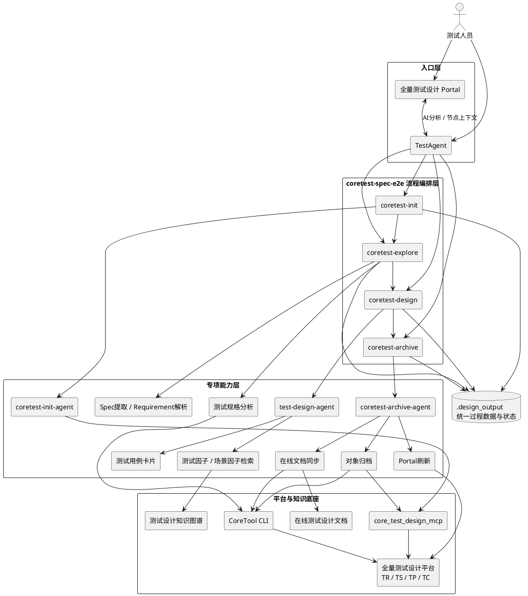

# E2E测试Agent进展及下一步规划

> 汇报时间：2026-09-21  
> 汇报范围：E2E测试Agent阶段进展、使用效果、下一步计划及测试领域知识诉求

## 1. 背景

测试领域已经具备需求分析、测试设计、脚本生成、代码检索、脚本调测等多类AI能力，但早期能力更多以单点Skill或独立流程存在，需求到测试资产、再到自动化实现之间仍需要较多人工串联。

E2E测试Agent的建设目标，是以**测试Spec和领域知识**为核心，将需求分析、测试规格、测试设计、测试资产归档逐步串成统一流程，并继续向自动化测试方案、AW/Codebase、脚本生成与调测延伸。同时通过公共Extension沉淀公共能力，降低不同产品重复建设和二次适配成本。

整体建设路径可以概括为：

```text
单点AI能力
    ↓
需求到测试设计E2E流程
    ↓
公共Extension与平台融合
    ↓
测试领域知识增强
    ↓
面向多产品规模复用
    ↓
设计到自动化执行闭环
```

当前阶段已经完成从“单点能力/流程穿刺”向“公共能力、真实业务使用和持续工程化”的转换，后续重点开始转向**DFX专业能力、领域知识和规模化复用**。

---

## 2. E2E测试Agent目标与效果衡量

### 2.1 目标、子专题与衡量方式

| 子专题 | 建设目标 | 核心建设内容 | 效果衡量 | 当前效果 |
|---|---|---|---|---|
| 需求 → 测试规格 | 从需求上下文自动完成测试分析和测试规格设计 | Init、Explore、TR/TS、Spec质检、普通/DFX测试规格 | TR/TS产出、Spec质量、人工修改量 | 主流程已打通，支持普通TS和平台DFX TS统一处理 |
| 测试规格 → 测试设计 | 根据TS生成可落入平台的TP/TC，并逐步引入专业测试准则 | Design、TP/TC生成、DFX设计、测试因子/场景因子 | 用例接纳率、TP/TC覆盖、DFX覆盖 | 穿刺需求用例接纳率 **92.6%**；因子关联主能力完成 |
| 测试资产平台化 | Agent产出直接进入现有测试生产流程 | Archive、TR/TS/TP/TC归档、在线文档、Portal卡片 | 自动归档范围、失败恢复、人工操作减少 | 已支持对象归档、在线文档同步、Portal刷新和卡片触发 |
| 测试领域知识增强 | 让Agent基于专业知识进行设计，而不是只依赖Prompt生成 | 图谱、测试因子、场景因子、DFX Spec、历史资产、调测经验 | 知识命中、因子关联、DFX设计效果 | 图谱和因子已融入主流程，DFX自主匹配正在建设 |
| E2E测试闭环 | 测试设计继续进入代码生成、执行与调测 | 自动化测试方案、AW/Codebase、脚本生成、自动执行、经验回流 | E2E测试占比、自动化执行覆盖 | E2E测试占比从 **0提升至5.29%** |
| 公共能力与多产品复用 | 将能力沉淀为公共Extension，减少产品重复开发 | Extension、卡片、流程配置、公共Skill、产品差异适配 | 下载量、复用产品数、用户问题闭环 | **247次下载，至少9个产品**基于公共包开发 |

### 2.2 阶段效果数据

截至 **2026-09-21**：

| 指标 | 当前结果 | 说明 |
|---|---:|---|
| `coretest-spec-e2e` 下载量 | **247** | 公共Extension已有实际使用基础 |
| 基于公共包开发的产品 | **≥9个** | 已从UPCF单场景穿刺扩展到多产品复用 |
| E2E累计产出测试用例 | **880个** | 分组实际业务产出 |
| E2E测试占比 | **0 → 5.29%** | 已从无E2E产出进入实际生产链路 |
| 同期AI生成用例占比 | **0.88% → 44.69%** | 整体AI生成指标，同期提升，不全部归因于E2E Test Agent |
| 穿刺需求用例接纳率 | **92.6%** | 独立穿刺需求效果评测，与880个用例统计口径不同 |
| 用户问题闭环 | **10个** | 已进入真实用户使用、反馈、修复闭环 |
| 发布版本记录 | **7个** | 从v0.1.11到v0.2.4 |
| 持续版本升级 | **6轮** | 7月28日至9月1日持续演进 |

**E2E测试占比口径：**

```text
AI辅助测试设计
∩
(
  (AI辅助测试代码生成入库 ∩ 自动化执行)
  ∪ AI辅助测试执行
)
÷ 新增用例
```

该指标强调的不只是“AI生成了测试设计”，而是AI辅助设计进一步进入代码生成、自动化执行或AI辅助执行链路。

> 数据来源：产品数字化与IT装备运营工作台、AgentCenter、穿刺需求效果评测及用户问题跟踪记录。

---

## 3. E2E测试Agent当前架构与流程设计

### 3.1 当前E2E架构

当前架构以 `coretest-spec-e2e` 公共Extension为流程主体，TestAgent和全量测试设计Portal作为入口；Init、Explore、Design、Archive负责主流程编排，专项Skill/Agent负责需求解析、测试设计、因子检索、对象归档、在线文档和卡片等具体能力；各阶段通过统一的 `.design_output` 目录传递确定性产物。



架构中的几个关键设计点：

- **统一入口**：既支持在TestAgent中手工执行命令，也支持Portal卡片从TR/TS节点直接触发Explore/Design；两种入口最终进入同一套流程。
- **主流程与专项能力解耦**：Init/Explore/Design/Archive负责阶段编排，复杂动作下沉到Agent、Skill和确定性脚本，降低主流程复杂度。
- **统一过程数据**：各阶段共享 `.design_output/<design_task_id>/TR_<tr_id>/`，通过文件契约传递上下文、设计产物、执行计划和状态，不依赖Agent记忆串联阶段。
- **AI分析与确定性操作分离**：测试规格、TP/TC设计和知识选择由Agent完成；平台对象创建、状态持久化、在线文档写入等确定性操作由脚本、CLI/MCP完成。
- **现有平台优先复用**：已有TR和平台DFX TS直接复用，不重复创建；Archive对成功对象幂等复用，保证重跑安全。

### 3.2 当前E2E流程设计

当前正式流程围绕**平台已有设计任务和TR**执行。Init负责准备统一上下文；Explore完成需求解析、普通/DFX测试规格及统一TS目录；Design按TS并行生成TP/TC和因子计划；Archive按用户指定范围完成对象、文档和Portal闭环。

```plantuml
@startuml
top to bottom direction

start

:coretest-init;
:获取设计任务、已有TR、直接关联需求;
:保存 design_task_info.json / tr_info.json / cida_info.json;

:coretest-explore <tr_id>;
:读取TR直接关联需求;
:下载并解析全部有效 IDP / DBOX 文档;
:生成 系统需求.md / 功能设计.md / SR Specs;
:查询平台已有TS;

if (TS来源?) then (平台DFX TS)
  :生成DFX测试规格;
  :保存 platform_ts_id;
  :Archive阶段复用平台对象;
else (Explore普通TS)
  :生成普通测试规格;
  :生成 tr_ts.json;
endif

:普通TS + DFX TS统一生成 ts_catalog.json;

if (用户选择归档Explore普通TS?) then (是)
  :仅生成普通TS归档计划;
  :创建普通TS并保存真实平台ID;
else (否)
  :跳过Explore阶段TS归档;
endif

:coretest-design <tr_id> [TS选择器];
:从 ts_catalog 解析稳定TS编号 / 平台TS ID;
:目标TS按每批最多3个并行处理;

repeat
  :初始化当前TS working卡片;
  :test-design-agent 单TS设计;
  :生成 TP / TC Markdown;
  :提取 TP / TC JSON;
  :图谱检索测试因子 / 场景因子;
  :生成并校验 factor_plan;
  :更新当前TS completed卡片;
repeat while (仍有目标TS?) is (是)

:coretest-archive <tr_id> <目标>;
:解析 TR / TS / TP / TC 精确归档范围;
:锁定对象计划和文档范围;

:coretest-object-archive;
:创建或复用 TS / TP / TC;
:归档阶段写入TS因子;
:新TP创建时原子关联TP因子;
:即时保存 archive_state.json;

:coretest-document-sync-agent;
:同步设计任务 / TR / 相关TS在线文档;

:test-portal-card;
:刷新Portal并汇总对象 / 文档 / Portal结果;

stop
@enduml
```

### 3.3 当前流程的核心约束

| 设计点 | 当前规则 |
|---|---|
| TR范围 | 正式流程以Init获取的已有TR为入口，后续阶段统一使用同一TR上下文 |
| 需求范围 | `tr_info.json.requirements[]` 是当前TR直接关联需求的权威范围 |
| TS统一编号 | 普通TS与平台DFX TS统一进入 `ts_catalog.json`，后续Design/Archive使用稳定 `TS_<NN>` |
| DFX TS | 平台已有DFX TS只查询和复用，不在Explore或正式Archive中重复创建 |
| Explore普通TS归档 | 用户可选择跳过，或仅归档本轮Explore生成的全部普通TS |
| Design并发 | 每批最多并行3个TS；一个 `test-design-agent` 只负责一个TS |
| 因子处理 | Design只生成本地因子计划；Archive执行平台真实关联 |
| 因子规则 | Scene TS/TP可使用场景因子+测试因子；其他TS/TP仅使用测试因子 |
| Archive | 指定对象只向上补齐父级依赖，不向下展开；成功对象重跑时复用 |
| 在线文档 | 对象归档与文档同步状态隔离；文档失败不回滚已成功对象 |
| 状态管理 | `archive_state.json` 持久化对象、因子和执行状态，支持幂等和断点续跑 |


---

## 4. 当前进展

### 4.1 主流程及当前重点工作

| 能力/工作项 | 当前状态 | 已完成或当前进展 | 后续重点 |
|---|---|---|---|
| Init | **进行中** | 已支持设计任务、TR和需求上下文获取 | 获取全量需求关联特性/功能，为后续TR创建提供关系数据 |
| Explore | **进行中** | 已支持普通TS、平台DFX TS、统一TS编号和平台交互 | 支持IR+SR、独立SR、全部需求合并、用户手工分组等TR多分支策略 |
| Design | **进行中** | 已支持按TR/TS设计TP/TC、稳定编号和平台TS ID输入 | DFX测试设计准则自主匹配分析并创建TP |
| Archive | **主要能力完成** | 支持TR/TS/TP/TC精确归档、对象复用、幂等状态、断点续跑 | 持续做多类型对象和异常路径回归 |
| 在线文档写入 | **完成** | 任务/TR/TS过程文档可写入对应章节，并与对象归档状态隔离 | 持续适配在线评审体验 |
| TS/TP因子关联 | **完成** | 已完成因子候选、因子计划及归档关联主能力；场景TS/TP支持场景因子+测试因子，其他类型使用测试因子 | 持续做扩展包完整回归和更多场景覆盖 |
| 流程策略配置化 | **进行中** | 已明确统一策略入口和分组对齐方向 | 将产品差异从Skill代码中抽离，降低多产品适配成本 |
| 新版测试用例卡片 | **未开始** | 已有旧版卡片和Portal双向通信基础 | 适配公司新版卡片、字段按需上报和IDE工程创建 |

### 4.2 版本演进

从7月28日至9月1日形成7个发布版本记录、完成6轮连续升级，演进重点不是简单增加功能，而是持续补齐工程稳定性、资产规范和平台融合。

| 阶段 | 代表版本 | 主要变化 |
|---|---|---|
| 基础闭环 | v0.1.11 / v0.1.12 | 打通需求探索、测试规格、测试设计到TR/TS/TP/TC归档；优化对象复用和状态管理 |
| 流程完善 | v0.2.0 | 增加IDP/DBOX需求文档支持，统一需求文档和CIDA信息，完善TR/TS/TP/TC精确归档 |
| 工程稳定 | v0.2.1 | 完成TR级适配、按指定TS执行、已有TR复用、执行计划持久化和断点状态管理 |
| 资产规范 | v0.2.2 | 测试用例卡片新增测试类型、自动化类型、设计描述等字段上报 |
| DFX与归档增强 | v0.2.3 | 平台DFX TS查询与统一编号、普通/DFX差异化归档、幂等复用、精确在线文档写入、断点续跑 |
| Portal深度融合 | v0.2.4 | Portal卡片与TestAgent双向通信，支持TR直接触发Explore、TS直接触发Design并自动传递上下文 |
| 当前develop | 0.2.5阶段 | 继续建设TS/TP因子选择和Archive关联闭环，并规划后续卡片、DFX准则和流程策略能力 |

版本演进可以概括为：

```text
流程跑通
  ↓
执行范围可控、失败可恢复
  ↓
测试资产字段规范
  ↓
普通/DFX统一处理和精确归档
  ↓
Portal与TestAgent融合
  ↓
领域知识和因子进入设计决策
```

### 4.3 配套能力建设

E2E测试Agent背后不仅是一个流程Extension，还同步建设了测试设计、代码生成和经验沉淀相关公共能力。

| 配套能力 | 作用 | 当前进展 |
|---|---|---|
| 测试设计知识图谱 | 按语义和关系检索测试域/设计域资产 | 已融入E2E设计流程 |
| 测试因子 / 场景因子 | 将测试设计经验结构化，并关联到TS/TP | 主能力已完成 |
| 相似用例/步骤检索 | 复用历史测试资产，支撑脚本生成 | 已提供公共Skill并在业务场景使用 |
| `aw-function-advisor` | 判断AW函数复用、修改或新增 | 已发布公共Skill |
| Codebase检索 | 支撑AW及脚本生成中的目标代码定位 | 已完成UPCF场景穿刺 |
| 调测轨迹经验提取 | 从脚本调测轨迹中提炼修复经验 | 已完成代码合入和服务部署 |
| 知识构建与消费方案 | 规划E2E测试Agent如何构建、检索和消费领域知识 | 已组织专题讨论、输出会议纪要并完成技术洞察分享 |

### 4.4 阶段工程投入与产出概览

| 阶段 | 代表性工作 |
|---|---|
| 6月～7月：从0到1 | Spec Web实验、代码仓建设、coretest-design流程和卡片适配、coretest-init方案、E2E录屏与发布支撑、卡片重复问题修复、三路并发、Design按TS传参、图谱融入、组织级Extension发布 |
| 8月：工程化和公共能力 | AW生成Skill及实验、发布`aw-function-advisor`、代码仓逆向文档、连续发布0.2.1/0.2.2/0.2.3、用例字段与归档优化、效果评估、用户问题定位、知识技术洞察分享 |
| 9月：知识增强和规模化 | TS/TP/TC Markdown契约、E2E测试Agent知识构建与消费专题讨论、调测轨迹经验代码合入与服务部署、因子关联、在线文档、DFX自主设计、TR分组和流程策略配置化持续推进 |

从工作范围看，当前建设已经覆盖：

- Init / Explore / Design / Archive **4个主流程阶段**；
- TR / TS / TP / TC **4类核心测试资产**；
- 普通、Scene、DFX等多类测试规格；
- Extension、Agent、Skill、MCP/CLI、Portal卡片、图谱、在线文档等多种工程形态；
- 真实用户使用后的问题跟踪、回归、发布和版本维护。

---

## 5. 下一步计划与知识诉求

### 5.1 下一步计划

下一阶段的重点不再只是增加流程节点，而是把不同测试专业的Spec、产品知识和自动化知识真正融入Agent，同时进一步降低多产品复制成本。

| 工作方向 | 主要工作 | 当前基础 | 下一阶段目标 | 主要工作量来源 |
|---|---|---|---|---|
| 主流程易用性 | Init特性/功能关系、Explore TR多分支、新版测试用例卡片 | 主流程已打通，Portal交互已有基础 | 产品可通过统一入口低成本完成设计流程 | 同时涉及Init、Explore、卡片、平台字段和回归 |
| 流程可扩展性 | 流程策略配置、Explore到TP分组策略对齐、多产品差异配置 | ≥9个产品已基于公共包开发 | 从“产品二次开发”进一步走向“配置化复用” | 需要统一策略契约并改造多个Skill，且必须保证现有产品兼容 |
| DFX Spec体系化融入 | **兼容性Spec、自动化Spec**，并逐步扩展性能、可靠性等DFX Spec | 已支持平台DFX TS，DFX自主匹配分析进行中 | Agent自动识别适用DFX、匹配准则并生成对应测试设计 | 每类Spec都需经历知识整理、结构化、检索、适用性判断、TP策略、平台映射、效果评测和业务穿刺 |
| 领域知识增强 | 产品知识、历史测试资产、测试模式、因子、场景因子、DFX准则、经验 | 图谱、因子、调测经验已有基础 | 从“检索到知识”升级为“基于知识自主做测试设计决策” | 需要统一知识表达、检索、版本范围和结果追溯，并在Agent链路中持续评测 |
| 自动化测试方案Spec | 以需求/接口设计为输入生成被测系统自动化交互方案 | AW、Codebase和脚本生成已有能力 | 打通测试设计到自动化实现之间的中间层 | 涉及组网、接口、数据准备、已有AW能力判断及方案持续沉淀 |
| 脚本生成与调测闭环 | 自动化方案 → AW/Codebase → 脚本生成 → 执行/调测 → 经验回流 | 已有AW Skill、相似检索、调测经验服务 | 形成从需求到执行、再到经验回流的完整闭环 | 需要把当前多个独立能力串成统一链路，并解决执行反馈和经验更新 |

其中，DFX Spec的融入建议形成统一模式：

```text
需求 / TS
   ↓
识别适用DFX维度
   ↓
检索对应Spec / 测试设计准则
   ↓
AI判断适用性
   ↓
结合产品知识和历史资产分析
   ↓
生成DFX TS / TP
   ↓
效果评测
   ↓
归档和持续复用
```

### 5.2 测试领域需要的知识

| 知识类型 | 主要内容 | Agent需要解决的问题 |
|---|---|---|
| 产品知识 | 架构、特性、功能、接口、消息、参数、组网、版本差异 | **测什么** |
| 测试设计知识 | TS/TP/TC、测试模式、测试因子、场景因子、DFX Spec/准则 | **怎么测** |
| 自动化知识 | 自动化测试方案、测试组网、AW、Codebase、历史脚本、数据准备 | **怎么实现** |
| 经验知识 | 调测轨迹、失败现象、根因、修复方式、历史问题 | **遇到问题怎么办** |

知识应当贯穿完整E2E流程，而不是只作为一次RAG检索：

```text
产品知识
   ↓
测试设计知识
   ↓
自动化知识
   ↓
执行与调测经验
   └────────→ 持续回流和更新
```

### 5.3 对知识平台能力的诉求

| 能力诉求 | 测试侧原因 |
|---|---|
| 统一知识表达 | 产品知识、TS/TP/TC、因子、DFX准则、自动化方案当前形态不同，需要统一对象和关系表达，避免各Skill重复定义 |
| 语义 + 关系联合检索 | 测试设计既需要找“相似内容”，也需要明确需求—特性—接口—测试规格—测试点之间的关系 |
| 产品和版本隔离 | 测试知识与产品、版本高度相关，需要避免不同产品或版本知识误用 |
| 知识持续更新 | 新需求、新测试资产、新自动化方案和调测经验应能持续沉淀，而不是靠人工周期性整理 |
| 来源和使用可追溯 | Agent生成某个测试点时，需要知道使用了哪些Spec、因子或历史资产，便于评审和问题定位 |
| 统一Agent消费接口 | 希望知识能力以统一Skill/MCP/API方式提供，避免每个Agent重复建设检索、权限、版本和格式适配 |
| 效果可评测 | 需要能够衡量“知识是否真正提升设计质量”，建立知识命中、引用、接纳、覆盖等持续评测能力 |

---

**阶段判断：**

前一阶段的核心工作是把E2E测试流程从0做到可用，并完成公共Extension、平台归档和真实业务使用；下一阶段的核心工作将从“流程自动化”进一步转向**“知识驱动的测试智能化”**：一方面持续提升多产品易用性和可扩展性，另一方面将兼容性、自动化及其他DFX Spec、产品知识、测试设计知识和自动化知识系统融入E2E流程，并继续向脚本生成、执行调测和经验回流延伸。
